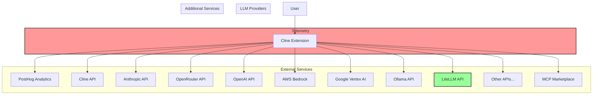
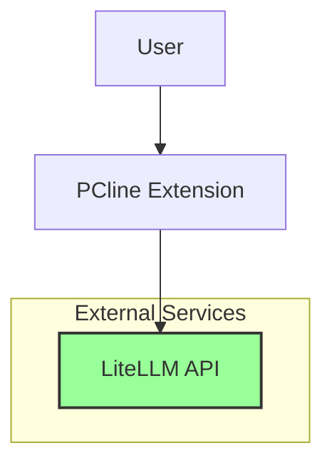

# PCline Project

PCline is a private fork of the Cline VSCode extension, optimized to minimize IP leakage risk by removing telemetry and focusing exclusively on the LiteLLM provider.

## Documentation

This repository contains the following documentation:

1. [Executive Summary](./pcline-executive-summary.md) - High-level overview and business case
2. [Modification Report](./pcline-modifications-report.md) - Detailed analysis of required changes
3. [Implementation Steps](./pcline-implementation-steps.md) - Specific code changes to make
4. [Verification Guide](./pcline-verification-guide.md) - How to verify the changes were successful

## Architecture Changes

The diagrams below illustrate the architectural changes from Cline to PCline:

### Original Cline Architecture

### PCline Architecture

## Implementation Overview

PCline makes the following key changes:

1. **Removes all telemetry components**
   - No PostHog analytics
   - No conversation data collection
   - No API usage metrics

2. **Removes all API providers except LiteLLM**
   - Simplifies codebase
   - Prevents accidental connections
   - Focuses on one trusted integration point

3. **Removes external service dependencies**
   - No Cline account authentication
   - No MCP marketplace connections
   - No external documentation links

4. **Tightens security**
   - Restricts Content Security Policy
   - Removes unused dependencies
   - Eliminates potential IP leakage vectors

## Getting Started

1. Review the documentation to understand the changes
2. Follow the [Implementation Steps](./pcline-implementation-steps.md)
3. Use the [Verification Guide](./pcline-verification-guide.md) to test your implementation
4. Deploy PCline within your organization

## Usage

PCline works exactly like Cline, but with LiteLLM as the only provider:

1. Configure your LiteLLM server URL and API key in settings
2. Use PCline features to interact with your AI models
3. Enjoy enhanced privacy and security while maintaining core functionality

## License

This fork maintains the original license of the Cline project.
